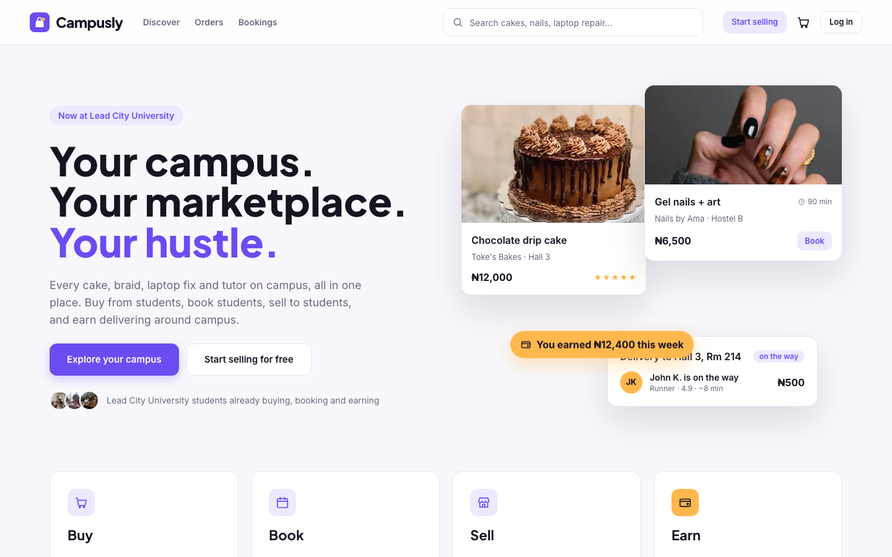
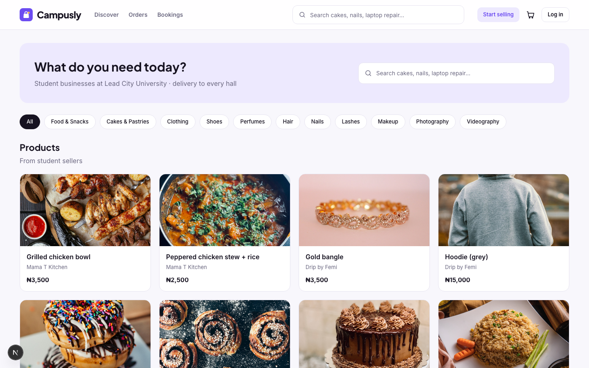
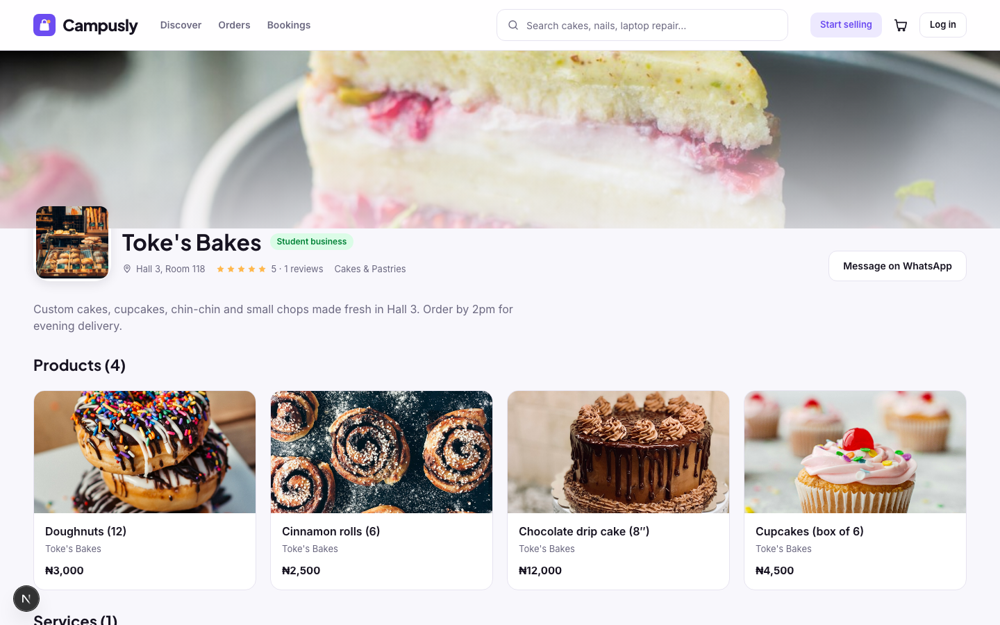

<p align="center">
  
</p>

<h1 align="center">Campusly</h1>

<p align="center"><b>Your campus. Your marketplace. Your hustle.</b><br/>Buy. Book. Sell. Earn.</p>

<p align="center">
  <a href="#the-problem">Problem</a> ·
  <a href="#the-solution">Solution</a> ·
  <a href="#features">Features</a> ·
  <a href="#how-a-transaction-works">How it works</a> ·
  <a href="#business-model">Business model</a> ·
  <a href="#tech-stack">Tech</a> ·
  <a href="#getting-started">Run it</a> ·
  <a href="#demo-walkthrough">Demo</a>
</p>

---

Campusly is a digital student-economy platform for university campuses. It brings the student businesses that already exist on every campus, scattered across WhatsApp statuses, Instagram pages and word of mouth, into one organised marketplace where students can **buy** products, **book** services into real time slots, **sell** through a free storefront, and **earn** by delivering orders across campus.



## The problem

Every campus already has hundreds of student businesses: cakes, hair, nails, laundry, repairs, tutoring, fashion, food. But they are invisible and informal:

- A student who needs a cake or a laptop fix has no idea who on campus offers it.
- Student entrepreneurs have no discovery, no booking system, no payment trail and no delivery. Everything runs on DMs and bank-transfer screenshots.
- Trust is a gamble. There are no reviews, no order history, no accountability.

## The solution

One platform, one account, four ways to use it:

| Role | What they do |
|---|---|
| **Customer** | Discover businesses, buy products, book services, pay in-app, track orders live, review only what they actually bought |
| **Seller** | Free digital storefront: list products with photos, receive paid orders, hand them to a runner, track earnings |
| **Service provider** | List services with price and duration, set weekly opening hours, take paid bookings into real time slots |
| **Runner** | See open delivery requests, accept one, deliver across campus, keep 80% of every delivery fee |

Roles stack on one account: a student can be a customer in the morning, a seller in the afternoon and a runner between lectures. Platform admins oversee users, businesses, orders and revenue, and can suspend bad actors.



## Features

**Marketplace**
- Search and category browsing across products, services and businesses
- Business profiles with cover photo, logo, location, WhatsApp contact and verified reviews
- Product pages with multi-photo galleries; cart locked to one seller per checkout

**Bookings**
- Providers set weekly opening hours; slots are generated from hours + service duration
- Taken and past slots are blocked; double-booking is rejected at write time

**Payments** (Paystack, test mode)
- Hosted checkout for orders and bookings; card, transfer, USSD
- Verified twice: on the redirect callback and via a signature-checked webhook; both idempotent
- Commission and revenue split recorded per transaction

**Delivery**
- Seller requests a runner when an order is ready
- Open requests show pickup, drop-off and pay before accepting; first accept wins
- Status flows through to the customer live: paid → preparing → ready → on the way → delivered

**Trust**
- Reviews can only be written on a delivered order or completed booking, once
- Ratings aggregate on the business profile

**Operations**
- Seller dashboard: products, services, orders, bookings, earnings with commission breakdown
- Runner dashboard: open requests, active deliveries, earnings
- Admin dashboard: users, businesses (with suspend), orders, bookings, deliveries, GMV and revenue split



## How a transaction works

A ₦12,000 cake ordered with campus delivery:

| | Amount | Goes to |
|---|---:|---|
| Product | ₦12,000 | Seller keeps ₦11,400 |
| Platform commission (5%) | ₦600 | Campusly |
| Delivery fee (paid by buyer) | ₦500 | Runner keeps ₦400 |
| Delivery margin | ₦100 | Campusly |
| **Buyer pays** | **₦12,500** | **Campusly earns ₦700** |

Bookings carry an 8% commission. All rates live in one config file.

## Business model

- Free to join and to create a business. Campusly only earns when a seller earns.
- Commission on successful product orders (5%) and completed bookings (8%).
- Delivery margin on every runner delivery.
- Later: promoted listings, premium seller tools, multi-campus rollout.

## Tech stack

| Layer | Choice |
|---|---|
| Framework | Next.js 16 (App Router) + TypeScript, server components and server actions |
| Styling | Tailwind CSS 4, design tokens defined once |
| Database | MongoDB Atlas + Mongoose |
| Auth | Auth.js v5, credentials + JWT sessions, role-based route protection in edge middleware |
| Payments | Paystack (hosted checkout + signed webhook) |
| Validation | Zod, shared between forms and server |
| Images | Upload endpoint (local disk in dev, Cloudinary in production) or paste-a-URL |

The code is layered: Mongoose models hold schemas only, a service layer holds all business logic, and pages/actions stay thin. UI primitives are data-free so the design can be restyled centrally.

## Getting started

```bash
npm install
cp .env.example .env.local   # MongoDB Atlas URI, AUTH_SECRET, Paystack test keys
npm run seed                 # demo campus: 5 businesses, listings with photos, demo accounts
npm run dev                  # http://localhost:3000
```

### Demo accounts (password `campusly123`)

| Email | Role |
|---|---|
| aisha@campusly-demo.com | customer |
| toke@campusly-demo.com | seller + provider (Toke's Bakes) |
| ama@campusly-demo.com | provider (Nails by Ama) |
| john@campusly-demo.com | runner |
| admin@campusly-demo.com | admin (`/admin`) |

Paystack test card: `4084 0840 8408 4081`, any future expiry, CVV `408`, PIN `0000`, OTP `123456`.

## Demo walkthrough

1. Log in as **Aisha** → Discover → Toke's Bakes → add the chocolate drip cake → checkout with campus delivery → pay with the test card.
2. Book **Gel nails + art** at Nails by Ama → pick a real slot → pay.
3. Log in as **Toke** → Dashboard → Orders → *Mark ready* → *Request runner*.
4. Log in as **John** → `/runner` → *Accept* → *Picked up* → *Mark as delivered*.
5. Back as **Aisha** → `/orders` shows the runner and the delivered timeline → leave a review.
6. **Ama** marks the booking completed; Aisha reviews it.
7. **Admin** → `/admin`: users, businesses, orders, deliveries, GMV and the revenue split.

### Notes

- If `mongodb+srv://` fails with `querySrv ESERVFAIL`, your network DNS can't resolve SRV records; use the direct `mongodb://host1,host2,host3/...` string from Atlas instead.
- `npm run make-admin -- you@email.com` grants admin to an existing account.

## Team

Built for **K-TECH FEST 3.0** by **Opanuga Aladetomiwa** (product, engineering, design) and **Opeyemi Ayejuro** (research, business strategy, pitch).

## Roadmap

In-app chat, multi-seller carts, automated payouts, refunds and disputes, live delivery tracking, promoted listings, campus ambassador program, multi-campus rollout.
